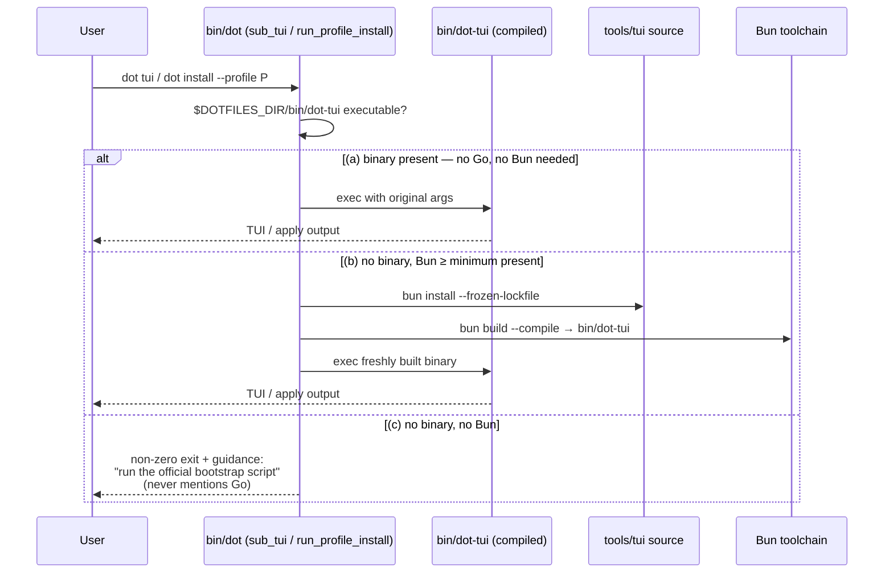

# Design: Migrate the Go TUI installer to Bun + TypeScript

**Change:** `migrate-tui-to-bun` · **Status:** approved-for-tasks · **Scope:** mechanical 1:1 port, no behavior change beyond what the six spec deltas mandate.

This document settles every implementation decision the tasks phase needs: where the TypeScript lives, how Bubbletea maps to Ink, how the compiled binary is produced and resolved by `bin/dot`, how fresh machines get it, how Go tests port to bun:test, and how profile I/O stays byte-compatible. Every decision favors the **boring option**: this is a port, not a redesign, and any cleverness is a behavioral-drift risk against specs that pin exact strings, orders, and key bindings.

## Quick path

1. Port `internal/installer/*.go` → `tools/tui/src/*.ts` one file at a time, tests alongside (`*.test.ts` under bun:test).
2. Compile once via `make build-tui` → gitignored `bin/dot-tui`.
3. Rewire `bin/dot` (`sub_tui`, `run_profile_install`) through one new resolver function with the spec'd 3-step order.
4. Swap Makefile/CI gates: `go vet`/`go test` → `tsc --noEmit` + `bun test`; delete all Go files and `go.mod`/`go.sum`.

## Architecture overview

Two modules replace four Go packages-worth of code, keeping Go's file boundaries so each port is diffable against its origin:

| Go source (deleted) | TS replacement | Notes |
| --- | --- | --- |
| `internal/installer/manifest.go` | `tools/tui/src/manifest.ts` | 31 components verbatim; typed `Component` interface |
| `internal/installer/profile.go` | `tools/tui/src/profile.ts` | defaults, load/save, validation, legacy migration table |
| `internal/installer/plan.go` | `tools/tui/src/plan.ts` | env detection, DFS planner, sequential executor |
| `internal/installer/tui.go` | `tools/tui/src/tui.tsx` | Ink port of the two-pane model |
| `cmd/dot-tui/main.go` | `tools/tui/src/main.ts` | flag mode + interactive loop |

Data flow (unchanged from Go):

```text
manifest.ts ──► profile.ts ──► plan.ts ──► execute.ts logic (in plan.ts) ──► main.ts prints/aggregates
     ▲              │             ▲
     │              ▼             │ environment detection (PATH scan)
     └────── tui.tsx (selection state) ─┘
```

---

## ADR-1: Source layout — `tools/tui/` with Go-mirroring filenames

**Decision.** All TypeScript lives in `tools/tui/`:

```text
tools/tui/
├── package.json          # name "dot-tui", private, engines.bun, deps: react, ink; devDeps: @types/react, ink-testing-library, typescript
├── bun.lockb             # committed; CI installs with --frozen-lockfile
├── tsconfig.json         # strict, jsx: react-jsx, moduleResolution: bundler, noEmit (build goes through bun)
└── src/
    ├── manifest.ts       ├── manifest.test.ts
    ├── profile.ts        ├── profile.test.ts
    ├── profile.migration.test.ts   # mirrors profile_migration_test.go 1:1
    ├── plan.ts           ├── plan.test.ts      # planner + executor (mirrors plan.go/plan_test.go)
    ├── tui.tsx           ├── tui.test.tsx      # ink-testing-library ports
    └── main.ts                         # entrypoint for bun build --compile; thin, untested directly (covered by Bats)
```

- Entrypoint: `tools/tui/src/main.ts`. `package.json`/`tsconfig.json` live at `tools/tui/`, making it an isolated workspace-like root without adding a Bun workspace to the repo root.
- `bin/dot` never hardcodes paths beyond `$DOTFILES_DIR`: binary at `$DOTFILES_DIR/bin/dot-tui`, sources at `$DOTFILES_DIR/tools/tui`. Both derive from the existing `DOTFILES_DIR` variable already exported in `bin/dot`.
- Test files sit next to their subjects, mirroring Go's per-file `_test.go` pairing so the port can be reviewed file-by-file.

**Rationale.** Mirroring Go's file layout makes the mechanical-port claim verifiable in review: reviewer opens `plan.go` and `plan.ts` side by side. A `packages/` monorepo layout was rejected — this repo has one TS package and does not need workspace machinery.

## ADR-2: Ink ↔ Bubbletea model mapping

**Decision.** One `useReducer` mirrors the Go `Model` struct field-for-field; the view is a pure function producing **the same ANSI strings** Go produced, rendered through `<Text>`.

State shape (exact mirror of `tui.go`):

```ts
interface TuiState {
  pane: "categories" | "components";
  catCursor: number;
  cursor: number;
  selected: Record<string, boolean>;
  applied: Record<string, boolean>;
  query: string;
  searching: boolean;
  review: boolean;
  reviewTop: number;
  submitted: boolean;
  width: number;
  height: number;
}
```

Translation rules used throughout the port:

| Bubbletea concept | Ink equivalent |
| --- | --- |
| `Model` struct | `TuiState` in `useReducer` |
| `Update(msg)` switch | reducer `switch (action.type)`; keys become `{type: "key", key: string}` actions |
| `Init() tea.Cmd` | none needed (model starts static) |
| `tea.WindowSizeMsg` | `useStdoutDimensions()` → dispatch `resize` |
| `View() string` | pure `view(state): string` helpers (`selectionView`, `reviewView`, `componentRows`, …) ported line-for-line; component renders `<Text>{lines.join("\n")}</Text>` |
| `tea.Quit` | `useApp().exit()` after setting `submitted = true` |
| `tea.NewProgram(model).Run()` loop in `main.go` | `main.ts` loop: `render(<App initialApplied={applied}/>)` via Ink, await exit, read submitted selection from a ref/callback, run headless apply phase, re-render a fresh `<App>` for the next round |

Key handling maps through Ink's `useInput((input, key) => ...)`: `tab`/`left`/`right` pane toggle, `/` search, printable chars append to query while searching, `space`/`a`/`n`/`enter`/`q`/`ctrl+c` dispatch per the Go switch, review-mode keys handled first when `state.review === true` (same precedence as Go). The pure helpers (`visibleIndices`, `firstIndexInCategory`, `clampViewport`, `counts`, `reviewRows`, `stateMark`) port as free functions taking state — they are the unit-testable core and keep the reducer thin.

ANSI styling: reuse the exact escape constants from `tui.go` (`ansiDim`, `ansiGreen`, `ansiYellow`, `ansiBold`, `ansiReverse`) instead of Chalk or Ink color props. Rendering raw escape codes inside `<Text>` reproduces the current look byte-for-byte and lets ink-testing-library frame assertions compare against the documented UI contract without color-normalization logic.

The `MarkApplied` / `ResetSubmission` methods become: `main.ts` seeds the next round's `<App initialApplied={…}>` prop; submission resets naturally because each round mounts a fresh component.

**Rationale.** The reducer-as-struct and pure-view-function choices maximize the amount of code that ports by transcription rather than reinterpretation, which is the cheapest way to satisfy "reproduce this interaction contract 1:1". Alternatives rejected: splitting into multiple Ink components per pane (more idiomatic React, but changes no observable behavior while multiplying drift risk); using Ink `<Box>` layouts (Ink's flexbox would subtly change spacing vs. the current padded-string rows).

### Interactive round: submit → save → plan → execute → link → reopen

The `main.ts` loop ports `cmd/dot-tui/main.go`'s `for` loop; each iteration mounts a fresh Ink `<App>`, so `MarkApplied`/`ResetSubmission` reduce to passing the updated applied set as props:

```mermaid
sequenceDiagram
    participant M as main.ts (loop owner)
    participant T as tui.tsx <App>
    participant P as profile.ts / plan.ts
    participant X as executor (plan.ts)
    participant L as dot link

    M->>T: render <App initialApplied={applied}/>
    T-->>M: user submits review → exit(submitted selection)
    alt quit without submission
        M-->>M: return — nothing executed, no write, no link
    end
    M->>P: saveProfile(profilePath, selection)  [atomic tmp+rename]
    M->>P: plan(selection, detectEnvironment(), applied)
    P-->>M: tasks + skips (print skip lines first)
    loop each task, strictly sequential
        M->>M: 🔧 label... (progress, once per component)
        X->>X: sh -c operation (HOMEBREW_NO_AUTO_UPDATE=1)
        X-->>M: Result{status, output} → ✅/⚠️/❌ line
    end
    M->>M: applied += components whose results all "installed"
    M->>L: run once with DOT_PROFILE=<path>
    L-->>M: ✅ Config links installed / ❌ failed
    Note over M,T: loop re-opens <App initialApplied={updated applied}/>;<br/>next round plans no tasks for newly installed ids
```

This is exactly the dot-tui spec's "Interactive Loop Persists Then Applies" contract; flag mode (`-profile/-apply/-dry-run`) is the same pipeline minus the TUI and the loop, with dry-run stopping before execute.

## ADR-3: Binary distribution — `bun build --compile` → gitignored `bin/dot-tui`

**Decision.**

- Makefile target `build-tui`:

  ```make
  build-tui:
      cd $(DOTFILES_DIR)/tools/tui && bun install --frozen-lockfile \
        && bun build --compile --minify src/main.ts --outfile $(DOTFILES_DIR)/bin/dot-tui
  ```

- Output artifact: `bin/dot-tui`, **committed to `.gitignore`**, built on demand by `make build-tui` or automatically by `bin/dot`'s resolver (ADR-4). Nothing in the repo ships a stale checked-in binary.
- Version pinning: a root-level `.bun-version` file (e.g. `1.2.4`) is the single source of truth; `package.json` `"engines": {"bun": ">=1.2"}` mirrors the *minimum* for friendly errors. CI reads `.bun-version` via `oven-sh/setup-bun@v2` with `bun-version-file: .bun-version`. `bin/dot` compares installed Bun against the minimum parsed from `.bun-version` before choosing the source-build path.

**Rationale.** Gitignore + build-on-demand means contributors never fight a binary merge conflict and users never run a binary older than their checkout. Committing the artifact was rejected (binary blobs in git age badly and break the "repo language count" goal); shipping only via `bun run` from source was rejected because fresh machines must not need Bun at runtime (spec: resolution step 1 requires neither Go nor Bun). `bun build --compile` produces a self-contained executable, satisfying that.

**Manifest consequence (required by the proposal's success criteria):** the `base` component's command `brew install go` MUST be removed (base keeps `xcode-select --install`). This stays within the installer-manifest spec (which pins size, IDs, required set, git/php specifics — not base's command list) and satisfies "no Go toolchain references remain". The installer-plan xcode-select scenarios remain satisfiable unchanged.

## ADR-4: `bin/dot` resolution order

**Decision.** One shell function replaces today's duplicated `go run` calls; both `sub_tui` and `run_profile_install` call it:

```bash
# bin/dot (new)
run_dot_tui() {
  local bin="$DOTFILES_DIR/bin/dot-tui"
  if [[ -x "$bin" ]]; then
    exec "$bin" "$@"                                  # 1. prebuilt/local binary
  fi
  if bun_ok; do                                       # 2. Bun ≥ min (.bun-version)
    echo "==> Building dot-tui (one-time)" >&2
    (cd "$DOTFILES_DIR/tools/tui" && bun install --frozen-lockfile &&
     bun build --compile --minify src/main.ts --outfile "$bin") || {
      echo "Build failed. Run the official bootstrap script:" >&2
      echo "  curl -fsSL https://raw.githubusercontent.com/agustinzamar/dotfiles/main/remote-install.sh | bash" >&2
      return 1; }
    exec "$bin" "$@"
  else                                                # 3. actionable guidance
    echo "dot-tui binary missing and Bun >= $(cat "$DOTFILES_DIR/.bun-version") not found." >&2
    echo "Run the official bootstrap script (installs everything needed):" >&2
    echo "  curl -fsSL https://raw.githubusercontent.com/agustinzamar/dotfiles/main/remote-install.sh | bash" >&2
    return 1
  fi
}
```

No Go check remains anywhere in these paths (`is_executable go` and `brew install go` lines are deleted).



Case (a) covers both a locally built binary and a release-downloaded one — the resolver does not distinguish them, matching the spec's "prebuilt release binary, when available locally".

**Rationale.** A single choke point means the three spec scenarios are testable in one place (Bats stubs `bun` and toggles the binary file). Inline `go run`-style interpretation was rejected: running TS from source on every invocation would require Bun at runtime forever, defeating the standalone-binary constraint.

## ADR-5: Fresh-machine bootstrap — prebuilt release download is the primary path

**Decision.** `remote-install.sh` gains one best-effort step between clone and `exec bin/dot install`: if `$TARGET/bin/dot-tui` is absent, try downloading the release asset for the detected arch (`dot-tui-darwin-arm64` / `-amd64`) from the repo's GitHub releases with `curl`/`wget`, `chmod +x`, and verify it executes (`"$TARGET/bin/dot-tui" -h >/dev/null 2>&1 || rm -f`). Any failure is silent — the flow continues and falls into `bin/dot`'s resolver (ADR-4), which still handles cases (b)/(c).

A Homebrew-based Bun install topic is **not** added to the automated install topics; installing Bun locally is documented for contributors only (`brew install oven-sh/bun/bun`), since case (a) machines never need it.

**Rationale.** At bootstrap time a fresh Mac may have neither Brew nor Bun (Xcode CLT git arrives late — see the existing tarball fallback in `remote-install.sh`). Only a static binary has zero runtime prerequisites, which is exactly why the dot-cli-bootstrap spec orders it first. Auto-installing Bun via Brew during bootstrap was rejected: it couples bootstrap success to Brew availability and slows the common path; the guidance message in case (c) already points at the official script for users who want the full setup.

## ADR-6: Test port strategy

**Decision.** Every Go test file gets exactly one bun:test counterpart (see ADR-1 layout):

| Go test | bun:test port | Technique |
| --- | --- | --- |
| `manifest_test.go` | `manifest.test.ts` | pure assertions on catalog array |
| `profile_test.go` | `profile.test.ts` | `node:fs` tmp dirs (`fs.mkdtemp` under `os.tmpdir()`); round-trip, validation, atomic-write/newline/no-temp-leftovers |
| `profile_migration_test.go` | `profile.migration.test.ts` | pure-data migration + idempotency + load-persists-migrated |
| `plan_test.go` | `plan.test.ts` | planner purity (inject env map), DFS order/skip semantics, executor with injected fake runner (async `(op) => ({output, err})`), progress-callback counting, dependency-failure blocking, summarize aggregation |
| `tui_test.go` | `tui.test.tsx` | `ink-testing-library` `render(<App …/>)` + firing synthetic keys through the input handler; assert on rendered frames (possible because views are plain strings) |

Runner abstraction: `plan.ts` exports `type Runner = (operation: string, signal?: AbortSignal) => Promise<{output: string; err?: Error}>`; production runner uses `Bun.spawn(["sh", "-c", op], {env: {...}, stderr: "pipe", stdout: "pipe"})` merging streams for combined capture. Cancellation maps Go's `context.Context` to `AbortSignal`: executor checks `signal?.aborted` before each task (recording `skipped/cancelled`) and aborting kills the child. Today nothing external cancels (Go used `context.Background()`), so a simple signal suffices.

What stays Bats: all existing integration tests exercising the real `dot` CLI remain untouched — they are the behavioral gate for flags (`install --profile`, `--dry-run`), link flows, and now also the three `bin/dot tui` resolution scenarios (stub `bun` on PATH, toggle `bin/dot-tui` existence, assert exit codes/messages).

Typecheck: `make check` gains `tsc --noEmit -p tools/tui` alongside `bash -n`. TypeScript is added as a devDependency for this (Bun transpiles but does not typecheck; `bun --check` only syntax-checks). CI gates become: `make lint` (shellcheck/shfmt, scripts list drops nothing since `bin/dot` stays), `make check`, `bun test` (from `tools/tui`), `make test` (Bats).

**Rationale.** Keeping 1:1 test-file correspondence makes "every existing Go unit test has a passing port" mechanically auditable in review. Dependency budget honored: runtime deps are `react` + `ink` only; everything else (typescript, ink-testing-library, @types/react) is devDependencies, and `bun:test`/bundler replace Go's testing/build toolchain natively.

## ADR-7: Profile JSON I/O — atomic rename, hand-rolled validation

**Decision.**

- **Atomic save** (`saveProfile` in `profile.ts`):
  1. Validate (see below); fail before touching the filesystem.
  2. `await fs.mkdir(path.dirname(target), {recursive: true})`.
  3. Serialize `JSON.stringify(profile, null, 2) + "\n"` (matches Go's `MarshalIndent` two-space form plus exactly one trailing newline).
  4. Write to a unique temp file in the **target directory**: ``${dir}/.profile-${process.pid}-${crypto.randomUUID()}``.
  5. `await fs.rename(tmp, target)` — same-directory rename is atomic on macOS/APFS; readers see either old or new content. Best-effort `fs.unlink(tmp)` on failure.
- **Validation** is hand-rolled (~20 lines, mirroring `LoadProfileData`): reject unknown ids (`invalid profile: unknown component "<id>"`), reject disabled required components, require a `components` object on parse (`invalid profile: components is required`). No zod.
- **Load pipeline** ports `LoadProfile` verbatim: missing file → defaults (not an error); parse → migrate legacy aggregates (table copied verbatim, reporting `changed: boolean`) → unknown-id rejection → fill missing ids with `false` → force required true → persist back **only when migration changed something**.

**Rationale.** The persisted format is a single flat `map[string]bool` whose entire validation surface is enumerated above; pulling in zod would add a runtime dependency to a compiled installer binary for zero additional safety, violating the no-heavy-deps constraint. Node/Bun `rename` gives the same atomicity guarantee as Go's `os.Rename` on the same filesystem — the tmp file must live in the target directory for that to hold (never `/tmp`). Key-ordering note: `JSON.stringify` preserves insertion order of loaded keys; since normalization fills all 31 ids in manifest order, saved profiles come out deterministic regardless of input file ordering — matching Go's map behavior closely enough that round-trip tests (not byte-diff tests against Go output) define compatibility.

## Contracts

Public surface of `tools/tui/src` (consumed by `main.ts` and tests):

```ts
// manifest.ts
export interface Component { id: string; label: string; category: string; default: boolean; required: boolean;
                             dependencies?: string[]; links?: string[]; commands?: string[] }
export const COMPONENTS: Component[];               // exactly 31 entries

// profile.ts
export interface Profile { components: Record<string, boolean> }
export function defaultProfile(): Profile;
export function loadProfile(path: string): Promise<Profile>;
export function saveProfile(path: string, p: Profile): Promise<void>;
export function migrateProfileData(p: Profile): { profile: Profile; changed: boolean };

// plan.ts
export interface Task { componentId: string; label: string; operation: string; dependencies: string[] }
export interface Skip { componentId: string; reason: string }
export interface Result { task: Task; status: "installed"|"failed"|"skipped"; output: string; started: Date; finished: Date }
export function detectEnvironment(): Record<string, boolean>;   // PATH scan, no execution
export function plan(profile: Profile, env, applied?): Promise<{tasks: Task[]; skips: Skip[]}>;
export function executeWithProgress(tasks, runner, signal?, progress?): Promise<Result[]>;
export function summarize(results: Result[]): Array<{componentId, label, status, output}>;
```

CLI flags preserved exactly: `-profile <path>`, `-apply`, `-dry-run` (parsed with `node:util.parseArgs`, which accepts single-dash forms; no dependency). Output strings — `skip <id>: <reason>`, `<label>: <command>`, `🔧 %s...`, `✅ %s installed`, `⚠️ %s skipped: %s`, `❌ %s install failed`, `✅ Config links installed`, `❌ Config links failed` — are ported character-for-character; Bats asserts several of them today.

## File-change summary

| File | Action |
| --- | --- |
| `cmd/dot-tui/**`, `internal/installer/**`, `go.mod`, `go.sum` | delete |
| `tools/tui/**` (sources + tests + `package.json`/`tsconfig.json`) | add |
| `bin/dot` | rewrite `sub_tui`/`run_profile_install` around `run_dot_tui` resolver; drop Go checks |
| `Makefile` | `go-test` → `bun-test` (+`build-tui`); `check` swaps `go vet` → `tsc --noEmit`; `.PHONY` update |
| `remote-install.sh` | best-effort release-binary download step |
| `.github/workflows/test.yml` | `setup-go`+`make go-test` → `setup-bun`(.bun-version)+bun-test/typecheck/build smoke |
| `.gitignore` | add `bin/dot-tui` |
| `README` / install docs | Go references → Bun/binary pointers |

## Rollout & rollback

Single PR; tag `pre-go-removal` at the last Go-only commit before merge so `git revert` (or the tag) restores a working Go installer atomically. Verification order on a real machine before merge: (1) `bun test` + Bats green, (2) `dot tui` interactive round installs + links + reopens, (3) `dot install --profile <saved-go-profile> --dry-run` loads a profile created by the Go version identically (legacy migration exercised), (4) fresh-VM bootstrap via `remote-install.sh` succeeds with only the downloaded binary present. Rollback triggers per proposal: bootstrap cannot obtain/build the binary, Bats regressions, or documented key/UI contract divergence.

## Risks

| Risk | Mitigation designed in |
| --- | --- |
| Ink rendering diverges from Bubbletea frames | Raw-ANSI string views (ADR-2) + ink-testing-library frame assertions ported from `tui_test.go` |
| Compiled binary size/startup unacceptable | Measure in tasks phase; documented fallback is `bun run src/main.ts` behind the same resolver (still no Go) |
| Fresh machine gets neither binary nor Bun | Resolution step 3 prints explicit guidance with non-zero exit; bootstrap prefers the zero-dependency release binary |
| Profile semantics drift breaks saved profiles | Migration table copied verbatim; round-trip/idempotency/load-persists tests are mandatory ports (ADR-7) |
| Bun version churn breaks compile | `.bun-version` pins CI and the resolver's minimum check |
