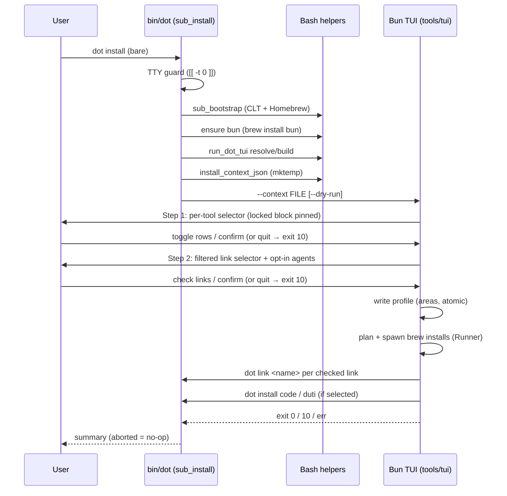

# Design — tui-default-install

Change: make the Bun TUI the default `dot install` experience (per-tool rows,
locked essentials, component-filtered config-link step), remove `dot tui`,
keep headless `--all` / `--profile`.

Base: `migrate-tui-to-bun` merged into `main` **before** this change applies.
That merge delivers `tools/tui/` (Ink/TS: `main.ts`, `manifest.ts`, `plan.ts`,
`profile.ts`, `tui.tsx` + co-located `*.test.ts`), the `run_dot_tui()` 3-step
resolver in `bin/dot` (prebuilt `bin/dot-tui` → build from source with bun →
loud error), `make build-tui` (`bun build --compile` → gitignored
`bin/dot-tui`), atomic profile writes in `profile.ts`, and a headless
`-apply -profile` mode. This document designs **only the delta on top**; it
does not re-design the TUI internals.

## 1. Architecture decisions

### ADR-1 — TUI decides, Bash executes (thin-context contract)

**Decision.** Bare `dot install` builds a *context file* (JSON, v1) on disk and
hands its path to the TUI. The TUI never parses Brewfiles or `links.sh`; every
mutating action it takes is either (a) a planned `brew install [--cask]`
spawn via the existing `plan.ts`/Runner machinery, or (b) a subprocess call
into `bin/dot` (`dot install code`, `dot install duti`, `dot link <name>`).
Symlink creation is never reimplemented in TypeScript.

**Rationale.**

- `links.sh` rows are Bash heredoc *functions* (`all_links`, `optional_links`);
  a TS re-parser would be a second source of truth for the link map and would
  drift. Calling `dot link <name>` reuses `link_named` → `_walk_links` →
  `link_file` exactly (with `LINK_FORCE` semantics: an explicitly chosen link
  bypasses the component gate — which is correct, the user just opted in).
- `code`/`duti` topics already have special installers (`sub_code`, `sub_duti`)
  with idempotence and warning behavior; delegation beats porting.
- Abort semantics become structural: nothing mutates until the user confirms,
  because both selectors precede any apply step.

### ADR-2 — Bash is the single manifest parser; context JSON is the contract

**Decision.** New `install/manifest.sh` (sourced by `bin/dot`) owns all parsing:

- `package_rows` — parses `install/topics/*`: strips comments/blanks, extracts
  `brew "x"` / `cask "x"` / `tap "..."` lines into rows
  `{topic, kind, name}`. Topics with special installers (`code`, `duti`) become
  one delegating row each.
- `area_for_package <name>` — an explicit `case` table mapping package →
  component area. Explicit table over inferred magic; one place to review.
  Areas are exactly the ids `links.sh` and `component_default_selected`
  already use: `base`, `shell`, `git`, `terminal`, `vscode`, `ai`,
  `ai-herdr`, `claude`, `desktop*`, plus catch-all `dev`, `media`, `desktop`.
  Examples: `zsh,fzf,gh→shell/base (locked)`; `git,lazygit,hunk→git`;
  `yazi,tmux,ghostty,eza,…→terminal`; `visual-studio-code→vscode`;
  `herdr→ai-herdr`; misc desktop casks→`desktop`.
- `link_rows` — emits `all_links` + `optional_links` verbatim (still the only
  consumer of those functions besides the link walkers).
- `install_context_json <file>` — writes the context file. JSON string
  escaping via a small pure-Bash `json_escape` (handles `"`, `\`, control
  chars). **No jq dependency**: on a fresh Mac jq arrives only after packages
  install, and the emitter runs before any install.

Context schema (versioned for forward compatibility):

```json
{ "version": 1,
  "locked":   ["base", "shell"],
  "packages": [ { "id": "ghostty", "topic": "core", "kind": "cask",
                  "area": "terminal", "locked": false, "default": true } ],
  "links":    [ { "name": "ghostty", "optional": false,
                  "rows": [ { "source": "config/ghostty/config",
                              "target": "/Users/x/.config/ghostty/config",
                              "mode": "" } ],
                  "component": "terminal", "requirement": "" } ] }
```

Multi-target names (`ghostty`, `yazi`, `vscode`, `agents`) collapse into one
entry with multiple `rows` — mirroring `link_named`'s name-keyed view.

**Drift prevention.** Exactly one parser per artifact: topics files are read by
`install/manifest.sh` (headless paths keep reading the same files via
`run_topic_file`/`brew bundle` — same bytes, no third copy); `links.sh` rows
are produced only by `all_links`/`optional_links`. The merged TUI's embedded
package manifest (Go-era 31-component command lists) is **retired as package
source of truth**: `manifest.ts` keeps only component metadata/planning helpers
and consumes context `packages` instead. `version: 1` lets the contract evolve
without silent misreads.

**Locked block.** `locked: ["base", "shell"]`; member rows (`zsh`, `fzf`,
`git`, `gh`, `tmux`) carry `"locked": true` and render pinned at top,
non-toggleable. Two locked pseudo-steps (`Zinit/Zsh setup`, `Git signing
config`) render as locked informational rows and always map to `sub_zsh` /
`sub_git` at apply time. Former forced baseline tools (`lazygit`, `hunk`,
`yazi`, `neovim`, Ghostty; `go` intentionally drops out — it lives in the
`dev` topic) are normal rows with `"default": true` (pre-checked,
toggleable).

### ADR-3 — Link-step filtering rule (requirement-first)

A link is **offered** iff:

1. `requirement ≠ ∅` → the package row with id `requirement` is selected.
   (Today's requirement values: `code`, `hunk`, `lazygit`, `git`.)
2. `requirement = ∅` → the link's `component` area is *active*: the area is in
   `locked`, or ≥1 selected row has that area.

This mirrors `_walk_links`' own gating pair (`component_selected(component)` +
`is_executable(requirement)`) evaluated against selections instead of PATH.
Scenario check: select only terminal tools → ghostty/tmux/yazi offered,
vscode excluded (its requirement `code` unselected). Select only the locked
block → shell links (zsh, p10k, starship) and `git` ignore offered; everything
else excluded. All rows default **unchecked**; the `agents` opt-in group
(`optional_links`) renders last, independent of tool selection, unchecked.

### ADR-4 — Profile persists area-level selections only

**Decision.** On confirmed apply, the TUI writes `$DOT_PROFILE` via the
existing atomic `profile.ts` writer with `.components[id] == true` for each
**active area id** (selected areas ∪ locked areas). Per-tool granularity is
session-scoped; link choices are never persisted.

**Rationale / interpretation.** `component_selected()` (used by bare
`dot link`, `dot update`) resolves area ids; storing anything else would break
`_walk_links` gating. The spec sentence "exactly for the selected components
and locked-block ids" is satisfied with *component = area id* — the same unit
`components.sh` has always used. Consequence (accepted, spec-blessed): if the
user unchecks `ghostty` but keeps another terminal tool, a later bare
`dot link` still links ghostty — free-form linking is explicitly unaffected.
Headless `--profile` therefore reinstalls at area granularity (today's
behavior), driven by the same context JSON.

### ADR-5 — Interactive launch pipeline in `sub_install`

Exact order for bare `dot install` (new `run_interactive_install`):

1. **Flag parse** (already in `sub_install`): `--all|-a` → `sub_full`;
   `--profile` → `run_profile_install`; anything else → topic path (unchanged).
2. **TTY guard**: `[[ -t 0 ]]` or fail: exit non-zero with
   "stdin is not a TTY — use `dot install --all` or `dot install --profile
   <path>`". Runs *before* any provisioning so piped-curl runs never hang.
3. **Bootstrap**: `sub_bootstrap` (Xcode CLT + Homebrew; already idempotent).
4. **Runtime**: `is_executable bun || run brew install bun`; then the merged
   `run_dot_tui()` resolution (prebuilt `bin/dot-tui` → `bun install
   --frozen-lockfile && bun build --compile` from `tools/tui/` → loud error).
   On a fresh clone there is no prebuilt binary, so the source-build branch is
   the expected fresh-machine path. Any failure here exits non-zero naming the
   headless flags (spec: never silent, never fall back to baseline).
5. **Emit context**: `DOT_CONTEXT=$(mktemp)`; `install_context_json`.
6. **Launch**: `run_dot_tui --context "$DOT_CONTEXT"` (argv, not env, so the
   contract is visible in `ps` and testable; `DOTFILES_DIR` inherited;
   `DRY_RUN` exported already and forwarded as `--dry-run`). Bash `exec`s
   nothing else; the TUI owns the screen until exit.
7. **Exit mapping**: `0` → report applied summary; `10` (reserved
   aborted-by-user) → "aborted — nothing installed, nothing linked", exit 0;
   any other non-zero → propagate loudly.



Apply-phase interruption (SIGINT mid-brew, link failure) prints a loud ❌
summary of completed vs pending steps before exiting non-zero — partial disk
state is allowed only if reported (spec: "reports the interruption loudly").

### ADR-6 — Headless `--profile` reuses the TUI binary's apply mode

Keep `run_profile_install` as `run_dot_tui -apply -profile <path>`
(post-merge form; the merged resolver replaced its `go run` body). `-apply`
mounts no interactive UI (proven by the liveness probe
`-profile <missing> -dry-run`), so "MUST NOT open the TUI" holds. Its apply
logic is reworked in this change to consume the context JSON + area-level
profile (ADR-4) instead of the retired embedded manifest — same code path as
interactive apply, guaranteeing the two modes cannot diverge.

### ADR-7 — Removals are mechanical; completion follows help

Delete from `bin/dot`: `sub_tui`, the `tui` token in `TOP_COMMANDS`, both
`tui` help lines. Completion parses `dot help` output, so removing the help
lines removes the completion with no extra work; the dispatcher's
`TOP_COMMANDS` membership test makes `dot tui` an ordinary unknown command
("…is not a known command."). No shim (personal repo). `resolve_install_target`
needs no change (`tui` is neither a `sub_*` nor a topic).

### ADR-8 — Build tooling tells the truth (Bun, no Go)

Post-merge, `migrate-tui-to-bun` already swapped CI and added `build-tui`;
this change finishes the job on `main`:

- **Makefile**: delete `go-test` and the `go vet ./...` line in `check`.
  `check := bash -n $(SCRIPTS)` + `tsc --noEmit -p tools/tui` +
  `bun test tools/tui` (via `make -C tools/tui check` if the merge landed such
  a target; otherwise inline). `lint` unchanged (shellcheck/shfmt). `.PHONY`
  loses `go-test`.
- **openspec/config.yaml**: context rewritten to “Bash CLI (`bin/dot`) + Bun/TS
  Ink TUI (`tools/tui/`) + Homebrew Bundle”; testing block: unit =
  `bun test` (tools/tui), integration = bats; verify/test commands =
  `make check && make lint && make test`; quality gates drop `go vet`;
  apply guidelines stop referencing `internal/installer`.

## 2. Selector architecture (delta on merged TUI)

- **Data**: rows come exclusively from context `packages` (flat, pre-grouped
  by `topic` for visual grouping). The retired embedded package list is
  deleted from `manifest.ts`; `manifest.ts` keeps planning/metadata helpers.
- **Step 1 (tools)**: locked rows pinned at top with a 🔒 marker; keyboard
  toggle handler skips `locked === true` rows entirely (not merely visually).
  All other rows individually toggleable, initial state = `default`.
- **Step 2 (links)**: computed on entering the step from ADR-3's rule over
  confirmed selections; groups: filtered links (unchecked), then opt-in
  `agents` group (unchecked). Multi-row names toggle as one unit.
- **Confirm (step 2)**: write profile → apply packages → apply links →
  special topics → exit 0. **Quit anywhere before confirm**: exit 10, zero
  writes (profile write happens only after link confirmation, so abort-at-
  link leaves even the profile untouched).
- Views stay pure-string Ink components (merged design), so
  `ink-testing-library` covers both steps; the filter rule gets plain
  `bun:test` unit tests against fixture contexts.

## 3. Fresh-machine bootstrap

Ordering is fixed in ADR-5: CLT/Homebrew → bun → TUI resolve/build → launch.
Failure at any point after the TTY guard is loud with `--all`/`--profile`
guidance; the guard itself fires first so `curl | bash` without flags dies in
milliseconds.

`remote-install.sh`: its `exec "$TARGET/bin/dot" install "$@"` already passes
`--all`/`--profile` through — the delta is documentation only (comment noting
that bare invocation is interactive and requires a TTY, headless = append
flags). No behavior change; the rollback pin ("revert remote-install.sh to
force `--all`") from the proposal remains available.

`make install` (`.DEFAULT_GOAL`) becomes interactive-by-default implicitly via
`dot install`; acceptable — it documents `--all` for scripts in README.

## 4. Files changed

| File | Change |
| --- | --- |
| `bin/dot` | `sub_install` bare-case → `run_interactive_install` (new); TTY guard; bun/runtime bootstrap; context emit; exit mapping. Delete `sub_tui`, `TOP_COMMANDS` `tui`, 2 help lines; rewrite install help section. `run_profile_install` stays on `run_dot_tui -apply -profile` |
| `install/manifest.sh` (new) | `json_escape`, `package_rows`, `area_for_package`, `link_rows`, `install_context_json` |
| `remote-install.sh` | Comment/docs only (TTY vs headless flags) |
| `tools/tui/src/context.ts` (new) + tests | Load + validate context file (hand-rolled, ~20 lines, matching `profile.ts` style) |
| `tools/tui/src/manifest.ts` | Drop embedded package/command tables; keep planner metadata; consume context rows |
| `tools/tui/src/tui.tsx` | Per-row selector w/ locked block; link step + opt-in group; two-step flow state |
| `tools/tui/src/main.ts` | `--context` argv parsing; exit codes (0/10/err); apply orchestration (profile → packages → `dot link` / `dot install code`+`duti`) |
| `tools/tui/src/plan.ts` | Rows → brew commands (`brew install x`, `brew install --cask x`) |
| `Makefile` | Remove `go vet`/`go-test`; `check` gains TUI typecheck + `bun test`; `.PHONY` |
| `openspec/config.yaml` | Stack/testing/gates rewritten for Bun reality |
| `README.md` | Interactive default, headless flags, `dot tui` gone |

## 5. Test plan

- **bats** (`test/*.bats`): bare `dot install` under a closed stdin exits
  non-zero naming `--all`/`--profile` (test harness has no TTY — assert for
  free); `dot tui` → unknown command; `dot help` shows no `tui`, shows new
  install wording; `--profile` and `--all` paths unchanged (dry-run);
  `install_context_json` golden-file test (escaping incl. `Application
  Support` paths); `dot tui` absent from completion-parsed help.
- **bun:test**: context loader validation; ADR-3 filter rule (table-driven:
  requirement hit/miss, locked area, inactive area, optional group);
  selector rendering (locked row ignores toggle key; per-row independence
  inside a topic group); multi-target link single-row toggle; exit-code 10 on
  quit at each step with zero filesystem writes (tmpdir assertion).
- **Manual smoke** (owner, post-apply): Terminal.app + iTerm2 run of bare
  `dot install --dry-run` end-to-end; fresh-VM check of the bun-bootstrap
  branch before removing the rollback pin.

## 6. Rollout & rollback

Commits: (1) `install/manifest.sh` + context emitter + tests; (2) TUI delta;
(3) dispatcher flip + removals + help; (4) Makefile/config/README. Each is
individually revertible; reverting (3) alone restores the old default entry
point. The TUI directory stays isolated (delete `tools/tui/` → Bash CLI
untouched). Profile writes remain additive area-shaped JSON; stale files are
harmless (`component_selected` falls back to defaults). Until the
fresh-VM bun-bootstrap is verified, `remote-install.sh` can be pinned to
`--all` by reverting only that file.

## 7. Risks / open items

- **Fresh-machine bun bootstrap unverified on clean hardware** — highest-risk
  requirement; mitigated by the loud-failure contract + `--all` pin (above).
- **Source-build latency on first run** (`bun install` + `bun build --compile`,
  ~59 MB binary): one-time per clone; acceptable for a personal repo; prebuilt
  release assets (published post-merge) shorten it later.
- **`area_for_package` table maintenance**: adding a package without an area
  falls into its topic's catch-all; a `bun:test` fixture asserts every
  `links.sh` component/requirement token resolves to ≥1 package row, so a
  rename in `links.sh` cannot silently orphan a link.
- **Spec interpretation note** (for review): "selected components" in
  installer-profile is implemented as *area ids* per ADR-4; flagged here so
  reviewers confirm the reading before tasks are written.
